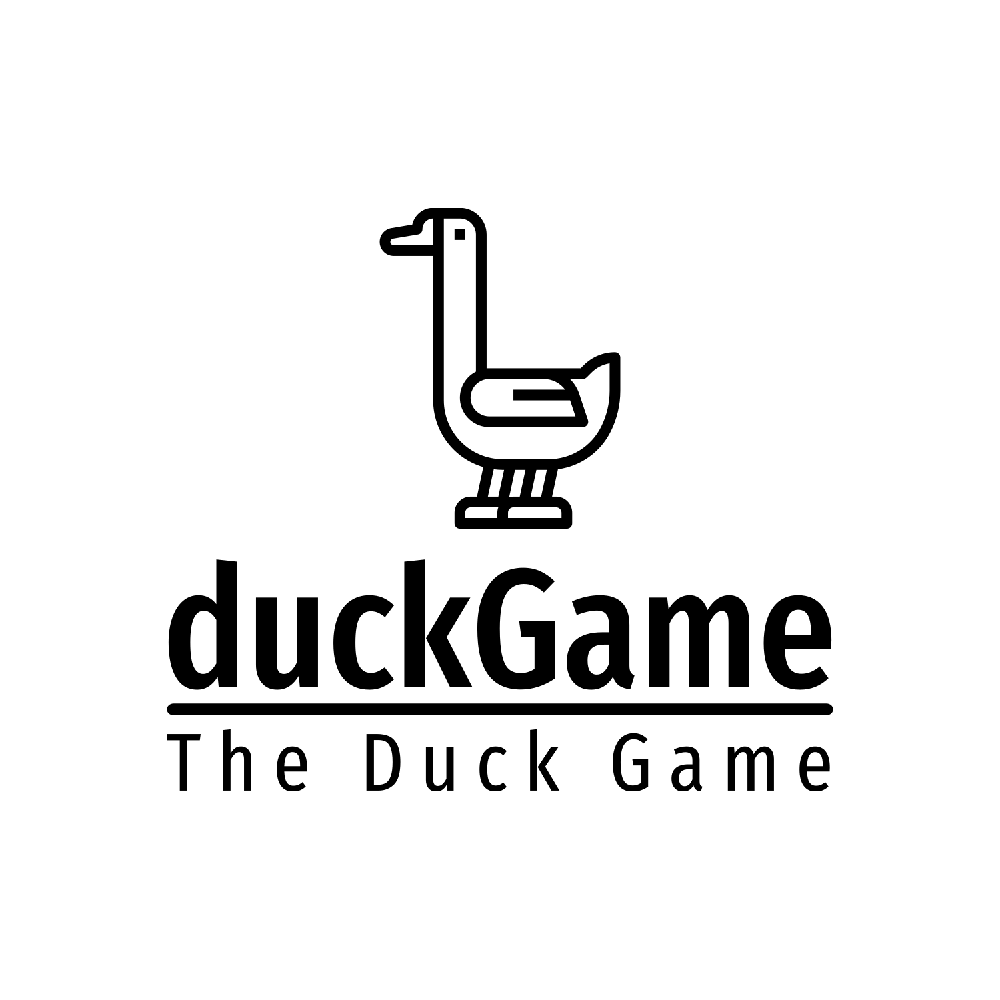

# PPS-22-duckgame
Project for `Paradigmi di Programmazione e Sviluppo` course of `University of Bologna` (A.Y. 2022/2023).
`PP-22-duckgame` is a remake of the popular **Gioco dell'oca** in *Scala* language.



Once the application is started, it'll possible to add up to 6 players before starting the game. 
Each player needs to choose a nickname and the color of its token.
After that, the game can be started and the winner is who gets exactly over cell #63 for first.

## Requirements
The following dependencies are required to run the application:
- sbt version 1.10.0
- Scala version 3.3.0
- JDK version 17

## Documentation
You can find project's report inside `report` folder into the `doc` branch, or by clicking [this link](https://github.com/AuroraLaghi/PPS-22-duckgame/tree/doc/report)

Futhermore, you can find the detailed description of the development process in the `process` folder, into the `doc` branch.  

## Usage
The latest `.jar` file of the application can be found inside the [Releases section](https://github.com/AuroraLaghi/PPS-22-duckgame/releases)

To execute the application, open a command prompt and run:
```powershell
$ java -jar `path-to-downloaded-jar`
```

Otherwise, you can clone the repository, open a command prompt from application's folder and execute the application with the following commands:

```powershell
$ sbt compile
$ sbt run
```

You can find user's guide [here](https://github.com/AuroraLaghi/PPS-22-duckgame/blob/doc/report/06-guida_utente.md)

## Test
You can clone the repository, move inside application's folder and execute tests with the command:

```powershell
$ sbt test
```

## Authors
- [Frattini Francesca](https://github.com/FrancescaFrattini)
- [Laghi Aurora](https://github.com/AuroraLaghi)
