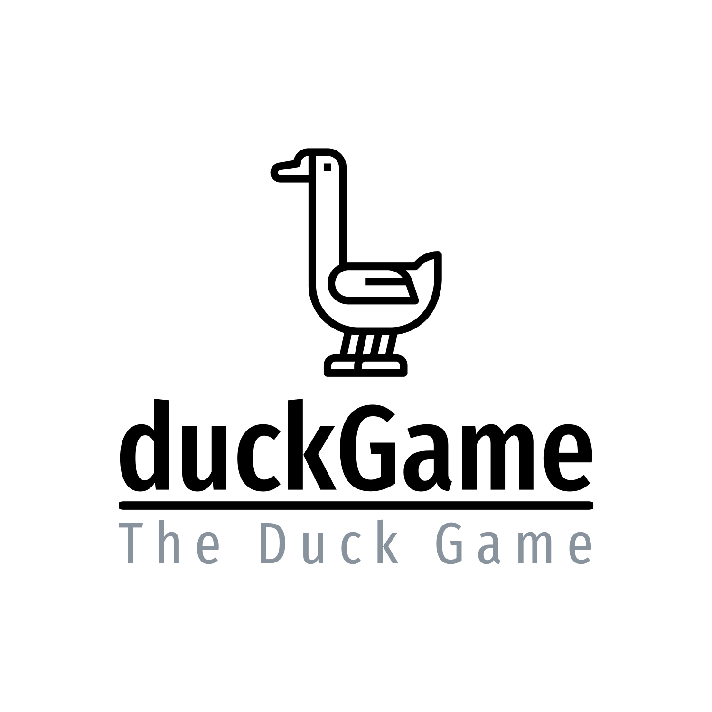

# Report finale PPS - duckgame

| Nome               |                Email                | Matricola   |
|--------------------|:-----------------------------------:|-------------|
| Frattini Francesca | francesca.frattini7@studio.unibo.it | 0001044370  |
| Laghi Aurora       |    aurora.laghi@studio.unibo.it     | 0001031289  |

# Introduzione

Il progetto consiste nella realizzazione di un software che replica, in linguaggio Scala, il famoso gioco da tavolo 
`Gioco dell'oca`.

Una volta avviata l'applicazione, verrà mostrato il tabellone di gioco, che consiste in un percorso a spirale suddiviso 
in caselle numerate.

Gli utenti, per procedere nel gioco, dovranno lanciare due dadi per avanzare lungo il percorso: può capitare che un 
giocatore finisca su una casella _speciale_ che potrà farlo avanzare, indietreggiare, fermarsi per un turno oppure 
rimanere bloccato fin quando un altro giocatore non capita sulla stessa casella.

La partita termina quando un giocatore si ferma sull'ultima casella del tabellone, oppure quando tutti i giocatori tranne uno abbandonando la partita.

