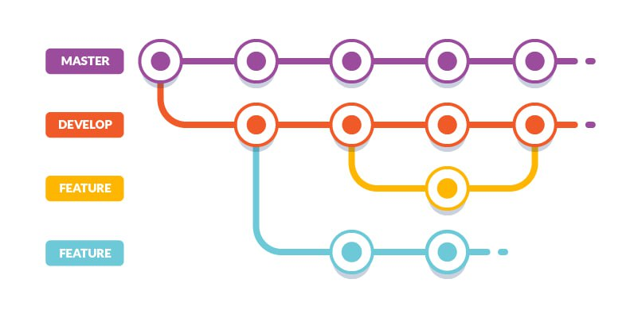

# 1. Processo di sviluppo

Per il processo di sviluppo, il team ha deciso di adottare un approccio di tipo _Scrum-inspired_. In particolare,
[_SCRUM_](https://www.scrum.org/) è un _framework_ di sviluppo software agile, iterativo ed incrementale, che consente la gestione di sviluppo 
del prodotto.

Nello specifico, tale processo consente di:

1. Nominare uno studente (ad esempio, chi ha l'idea del progetto), che fungerà da _committente_ o _esperto del dominio_,
 e che cercherà di garantire l'usabilità e la qualità del risultato
2. Designare uno studente (ad esempio chi possiede doti di coordinamento) che ricoprirà il ruolo di _product owner_
3. Realizzare un meeting iniziale in cui redigere il _product backlog_ e definire un primo sprint organizzativo
4. Fare utilizzo di sprint brevi (da 15-20 ore di lavoro), con lo scopo di ottenere ad ogni sprint dei risultati 
concreti, quindi con un valore per gli _stakeholders_
5. Fare meeting frequenti ed a inizio/fine sprint (opportunamente documentati da brevi report del risultato, 
anch'essi da tenere in versione), realizzando un _sprint backlog_ per tener traccia dell'organizzazione del lavoro

## 1.1 Incontri

La pianificazione dei meeting si è svolta definendo inizalmente un ordine del giorno, redatto dal _product owner_, 
con il contributo dell'altro membro del team, che può proporre modifiche o nuovi argomenti di discussione.
Si è optato per incontri brevi e frequenti, quasi giornalieri, al fine di tenere i membri del team aggiornati sullo 
stato di avanzamento del progetto.

Per quanto riguarda gli sprint, come già menzionato sopra, sono stati condotti nell'arco di una settimana lavorativa
 e sono stati oggetto di discussione in incontri all'inizio e alla fine del periodo.
Durante l'incontro iniziale dello sprint, si è definito il _product backlog_ relativo, mentre nel meeting di chiusura 
dello sprint, sono stati esaminati i risultati ottenuti e riveduto il lavoro svolto.

I vari meeting sono stati svolti in maniera ibrida, utilizzando piattaforme per le videoconferenze e mediante incontri
in presenza.

Ogni meeting ed il relativo ordine del giorno sono stati registrati in un file apposito, facilmente accessibile
tra gli artefatti del progetto.

Ogni sprint è caratterizzato dalle seguenti attività:

- **Sprint Planning** 
Seguendo la natura di SCRUM, lo sprint planning è stato suddiviso in due parti: la prima è dedicata alla 
preparazione dello sprint, cioè al delineamento dei vari task, estratti dal Product Backlog, da svolgere all'interno 
dello sprint stesso. Al termine di questa prima fase, si ottiene come risultato lo **Sprint Goal**, un file riassuntivo 
degli obiettivi dello sprint. 
Lo Sprint Goal ha reso flessibile il lavoro in preparazione della seconda fase dello Sprint Planning.
Nella seconda fase il team si è occupato di scegiere, in base alle tempistiche, quali task dovranno essere completati 
nello sprint attuale. Al termine di questa fase si ha come risultato lo **Sprint Backlog**, un approfondimento del 
Product Backlog trattato.
- **Daily Scrum**
Durante gli sprint, con cadenza quasi giornaliera, sono effettuati dei Daily Scrum, della durata di circa 15 minuti, 
con lo scopo di sincronizzare il lavoro e riportare eventuali difficoltà.
- **Sprint Review**
Si tratta di un incontro svolto al termine dello sprint che ha lo scopo di analizzare il risultato ottenuto per revisionare 
e valutare il lavoro svolto dal team di sviluppo.

## 1.2 Suddivisione in itinere dei task

Alla fine di ogni Sprint Planning, prendendo come base lo Sprint Backlog, attraverso il software **Trello**, sono stati 
rappresentati i task all'interno di una **Sprint Task Board**. Ciascun task è stato assegnato ad uno o più componenti del 
team.
Nella Task Board sono presenti diverse liste, ognuna rappresentativa di uno stato evolutivo del task.
Le tipologie di liste utilizzate sono: _TO-DO_, _Doing_, _Testing_, _Done_, _Waiting_.
Attraverso questo schema, ogni componente del team avrà una panoramica sul lavoro totale.

A seconda della tipologia, i task sono stati assegnati ad un singolo membro, oppure sfruttando il _pair-programming_.
Per ogni task individuato e stata considerata la seguente _definition of done_: una funzionalità è da considerarsi 
conclusa nel momento in cui viene testata, documentata, passa una _code review_ (manuale o automatica) e soddisfa le 
aspettative del committente.

## 1.2.1 Revisione in itinere dei task

Al termine di ogni sprint è stata effettuata la revisione del lavoro svolto durante la settimana: in particolare, viene 
verificata la realizzazione dei task assegnati ad ogni membro, analizzandone la loro completezza in base al _definition 
of done_ stabilito.

Durante l'incontro, se vengono evidenziati alcuni aspetti del lavoro effettuato che possono essere migliorati, o in caso 
di incompletezza nel lavoro svolto, si richiede al membro responsabile di correggere o completare il lavoro, prima di 
passare allo sprint succesivo.

Infine, dopo aver effettuato lo Sprint Review, è possibile effettuare il _refactoring_ di elementi già realizzati, creando 
nuovi task da concludere nello sprint successivo.

## 1.3 Workflow

Per quel che riguarda l'organizzazione del [repository GitHub](https://github.com/AuroraLaghi/PPS-22-duckgame) si è 
scelto di adottare **Git Flow**: questo prevede l'impiego di diversi _branch_:

- Un branch **main**, in cui è presente il codice delle _release_;
- Un branch **develop** da usare come branch principale;
- Un branch **feature/<nome-feature>** dove sarà presente il codice necessario all'implementazione di una determinata 
feature.

Nell'immagine seguente è possibile avere un riassunto di questa metodologia di lavoro

Per concludere, si è fatto utilizzo della [conventional commit specification](https://www.conventionalcommits.org/en/v1.0.0/), 
per uniformare la struttura dei commit tra i membri del team.

## 1.4 Strumenti utilizzati

Per la realizzazione del progetto sono stati utilizzati diversi tool, con lo scopo di agevolare gli sviluppatori durante 
la creazione del progetto, cercando di automatizzarne diversi aspetti.
I vari strumenti di supporto impiegati sono:

- **sbt** per la build automation,
- **ScalaTest** per la scrittura ed esecuzione dei test,
- **ScalaFMT** per la formattazione del codice,
- **GitHub**, come servizio di hosting del codice sorgente ed i file utilizzati durante il processo di sviluppo
- **GitHub Actions**, per garantire la Continuos Integration
  - È stato definito un file _YAML_ per descrivere le pipelines: ad ogni _push_/_pull_ sul branch main o develop, 
  l'applicativo viene compilato e testato su diversi sistemi operativi con JVM 11 e 16
- **Trello**, come strumento per la collaborazione all'interno del team