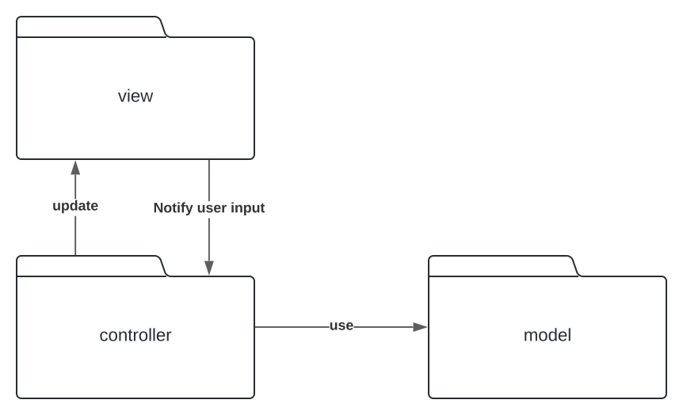

# 3. Design Architetturale
Dopo aver stabilito i requisiti e considerata la natura del progetto, il team durante il primo sprint ha optato per l'adozione
del _pattern architetturale MVC_ per la progettazione e l'implementazione dell'applicativo. 

## Architettura complessiva
A seguire è riportato il diagramma ad alto livello del sistema implementato seguendo il pattern MVC.

 

  

I componenti come si evince dallo schema sono 3:
- **Model**: al cui interno sono state poste tutte le entità che si occupano di gestire la logica di gioco.
- **View**: in cui è possibile trovare tutte le interfaccie grafiche per l'interazione con il sistema.
- **Controller**: ricopre il ruolo di ponte fra model e view, occupandosi dello scambio di informazioni fra questi due.

In sintesi, si è deciso di utilizzare questo pattern in quanto permette di effettuare una suddivisione più chiara degli incarichi
all'interno dei diversi moduli; inoltre, favorisce il riuso del codice, facilita la manutenzione del software e ne agevola la scalabilità.

