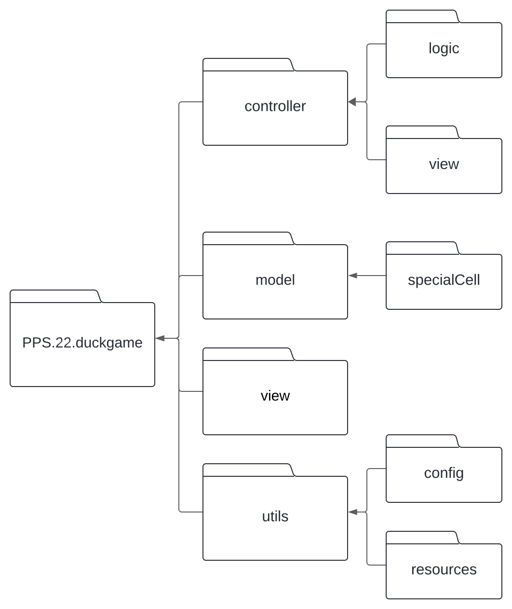
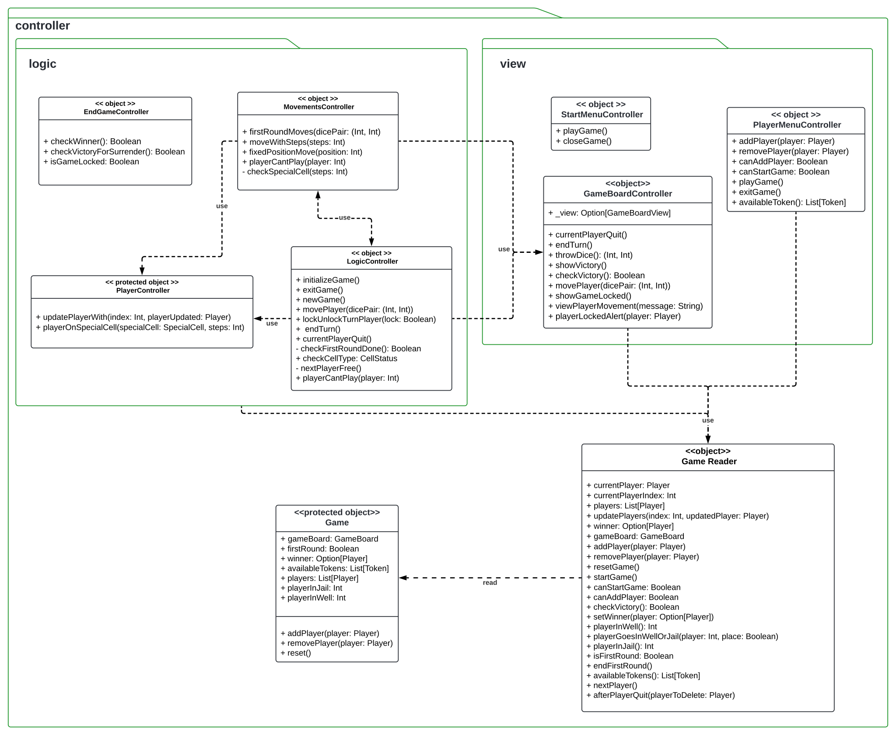
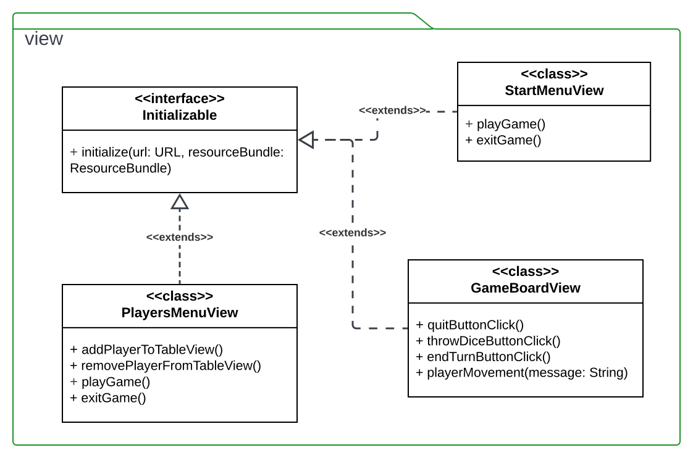

# Design dettagliato 
In questo capitolo verrà descritta nel dettaglio l'architettura del progetto, analizzando i
principali componenti e le rispettive caratteristiche. Oltre a quelli già citati, alcuni dei quali
sono divisi in sotto-moduli, è presente 1 package ulteriore contenente vari oggetti di utility.

Nella figura sottostante è schematizzata la gerarchia su cui sono stati organizzati i vari moduli
del progetto.

A seguire l'analisi di ogni singolo modulo coi rispettivi sotto-moduli.

## Controller
In figura viene mostrato il modulo *Controller* insieme ai rispettivi sotto-moduli *logic* e *view*.

### Sotto-modulo *view*
Al suo interno sono state raggruppate le logiche di interazione tra View e Model rispettando il pattern MVC attraverso le classi seguenti.

#### StartMenuController
Si occupa della gestione della comunicazione con la con la vista iniziale `StartMenuView` offrendo due comandi:
- `playGame`: passa alla schermata di configurazione `PlayersMenuView`
- `closeGame`: termina il gioco 

#### PlayerMenuController
Gestisce la comunicazione con la schermata `PlayersMenuView` offrendo una serie di metodi fra cui:
- `addPlayer`: aggiunge un nuovo giocatore
- `removePlayer`: rimuove un giocatore
- `availableToken`: restituisce la lista dei token ancora disponibili per i nuovi giocatori
  
#### GameBoardController
Ha il compito di gestire la comunicazione con la schermata di gioco `GameBoardView` esponendo metodi come:
- `currentPlayerQuit`: viene chiamato quando un giocatore abbandona la partita
- `endTurn`: indica la terminazione del turno di un giocatore
- `throwDice`: rappresenta il lancio dei dadi
- `movePlayer`: prende il ingresso la coppia di dadi lanciata e sposta il relativo giocatore di un numero di celle pari alla somma dei dadi
- `checkVictory`: dichiara se c'è un vincitore in quel momento del gioco restituendo un booleano che indica se l'operazione è andata a buon fine o meno 
- `showGameLocked`: gestisce lo scenario in cui il gioco è bloccato
- `playerLockedAlert`: prende in ingresso il giocatore attuale e informa che questo è bloccato su una casella speciale (Pozzo o Prigione), se era presente già un altro giocatore sulla stessa cella allora questo sarà libero di riprendere la partita
 
### Sotto-modulo *logic*
Qui è possibile trovare parte della logica di gioco.

#### LogicController
Object che si occupa principalmente della gestione della logica di gioco. Fra i metodi principali è possibile trovare:
- `initializeGame`: inizializza la lista dei giocatori mescolandone l'ordine
- `movePlayer`: miove il giocatore corrente di un numero di passi uguale alla somma del `dicePair` in ingresso
- `lockUnlockTurnPlayer`: indica se un bloccare (`lock` = true) o sbloccare (`lock` = false) il giocatore corrente
- `checkCellType`: ritorna `CellStatus`, cioè il tipo di casella su cui si trova il giocatore corrente (`STANDARD_CELL` o `SPECIAL_CELL`)
- `nextPlayerFree`: metodo *ricorsivo* utilizzato per trovare il prossimo giocatore disponibile, saltando i giocatori bloccati o in prigione/pozzo
- `playerCantPlay`: blocca il giocatore indicato da `index` in prigione o nel pozzo e sblocca l'eventuale giocatore precedentemente bloccato sulla stessa casella 

#### MovementsController
Object che controlla il movimento dei giocatori e gestisce le caselle speciali. Espone i seguenti metodi:
- `firstRoundMoves`: chiamato quando un giocatore deve muoversi nel primo turno di gioco. Se un giocatore ottiene 9 nel primo turno viene spedito sulla casella 23 o 53 in base alla combinazione di `dicePair`, altrimenti vincerebbe la partita
- `moveWithSteps`: controlla se il giocatore, a seguito di un movimento di #n `steps`, è finito su una casella speciale e attiva l'azione correlata a tale casella
- `fixedPositionMove`: sposta il giocatore che è finito su una casella speciale fino alla nuova `position`
- `playerCantPlay`: controlla se `player` è finito in prigione o nel pozzo, in caso affermativo lo blocca 

#### PlayerController
Object che si occupa di controllare i movimenti dei giocatori esponendo i metodi:
- `updatePlayerWith`: aggiorna un giocatore esistente nella lista dei giocatori in gioco, prendendo in ingresso l'index del giocatore che si desidera aggiornare e l'oggetto playerUpdated che contiene le informazioni da associare al giocatore indicato
- `playerOnSpecialCell`: gestisce l'azione innescata quando un giocatore atterra su una casella speciale durante una partita, prendendo in ingresso la SpecialCell (cella speciale su cui il giocatore atterra) e gli Steps (numero di passi che il giocatore ha compiuto prima per atterrare su quella cella)

#### EndGameController
È un object che si occupa della logica di fine gioco, attraverso metodi come:
- `checkVictoryForSurrender`: controlla se è rimasto un solo giocatore in gioco e nel caso lo setta come vincitore in `GameReader`
- `isGameLocked`: controlla se il gioco si trova in uno stato di 'stallo', cioè rimangono in gioco solo due giocatori ed entrambi sono bloccati sulle caselle speciali, Pozzo e Prigione.

### Game
Questo object modella il concetto di “gioco” ed è accessibile solamente all’interno del modulo *Controller*. In particolare, viene richiamato e modifficato solamente dal `GameReader`. Espone i seguenti metodi:
- `players`: lista dei giocatori
- `availableTokens`: lista delle pedine ancora disponibili 
- `gameBoard`: tabellone di gioco
- `winner`: eventuale vincitore del gioco
- `palyerInJail`: giocatore sulla casella speciale della prigione
- `playerInWell`: giocatore sulla casella speciale del pozzo
- `reset`: resetta lo stato di gioco, in particolare setta i valori di default `currentPlayer`, `players`, `winner`, `gameBoard`, `firstRound`, `playerInWell`, `playerInJail`, `availableTokens`

### GameReader
Tramite questo object è possibile leggere tutti i dati del `Game`, aggiornando le viste senza infrangere la logica del pattern MVC:
- `currentPlayer`: ritorna il giocatore corrente
- `canStartGame`: verifica se è possibile iniziare la partita, cioè se è stato raggiunto il numero minimo di giocatori (2)
- `canAddPlayer`: verifica se è possibile aggiungere un altro giocatore, cioè se non è stato raggiunto il numero massimo di giocatori (6)
- `checkVictory`: controlla se è presente un vincitore, quindi la partita è conclusa
- `playerGoesInWellOrJail`: attraverso i parametri in ingresso, l'oggetto `player` e il boolenao `place` viene controllato se il giocatore corrente è nel pozzo (true) o in prigione (false)
- `afterPlayerQuit`: si occupa di gestire lo stato del gioco a seguito dell'abbandono della partita da parte di `playerToDelete` in ingresso
- `nextPlayer`: viene settato il turno al giocatore successivo nell'ordine di gioco
- `endFirstRound`: imposta il flag `firstRound` nell'oggetto `Game` su "false", indicando che il primo turno è terminato
- `updatePlayers`: aggiorna le informazioni del giocatore puntato da `index` all'interno della lista `Game.players` e inserisce i nuovi dati all'interno dell'oggetto `updatedPlayer`

## Model

## View
A seguire viene mostrato il modulo *view*. Importante ricordare che tutte le viste possono recuperare informazioni sullo stato del `Game` attraverso `GameReader` che **consente di leggere e non scrivere informazioni**.

Seguendo il pattern MVC, questo modulo implementa le viste per facilitare l'interazione tra il giocatore e il sistema. Il controller gestisce questa interazione e agisce di conseguenza sul model. Il modulo è composto da 3 viste, ognuna delle quali eredita dall'interfacci `javafx.fxml.Initializable`:
- `GameBoardView`: rappresenta la vista del tabellone di gioco in cui sono presenti i comandi:

  - `quitButtonClick`: permette al giocatore corrente di abbandonare il gioco
  - `throwDiceButtonClick`: concede il lancio dei dadi attraverso `GameBoardController.throwDice`
  - `endTurnButtonClick`: permette al giocatore di terminare il proprio turno, passando per `GameBoardController.endTurn`
  - `playerMovement`: aggiorna l'area di testo del messaggio con il `message` passato in input
    
- `PlayersMenuView`: rappresenta la vista di configurazione per impostare i giocatori e offre i seguenti comandi:

  - `playGame`: per avviare la partita
  - `exitGame`: per terminare il gioco
  - `addPlayerToTableView`: per aggiungere un nuovo giocatore nella lista di gioco
  - `removePlayerFromTableView`: per elimare un giocatore dall'elenco di quelli già aggiunti nella lista
    
- `StartMenuView`: rappresenta la vista di avvio del gioco, al suo interno si trovano i bottoni:

  - `playGame`: per avviare il gioco
  - `exitGame`: per terminarlo 
  
## Utils
