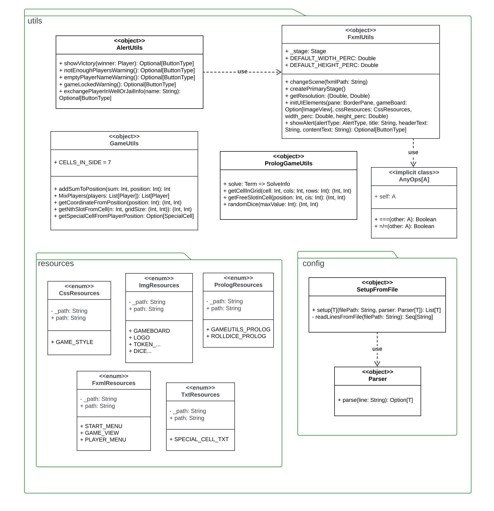

# 4. Design dettagliato 
In questo capitolo verrà descritta nel dettaglio l'architettura del progetto, analizzando i
principali componenti e le rispettive caratteristiche. Oltre a quelli già citati, alcuni dei quali
sono divisi in sotto-moduli, è presente 1 package ulteriore contenente vari oggetti di utility.

Nella figura sottostante è schematizzata la gerarchia su cui sono stati organizzati i vari moduli
del progetto.

  

A seguire l'analisi di ogni singolo modulo coi rispettivi sotto-moduli.

## Controller
In figura viene mostrato il modulo *Controller* insieme ai rispettivi sotto-moduli *logic* e *view*.

  

### View
Al suo interno sono state raggruppate le logiche di interazione tra View e Model rispettando il pattern MVC attraverso le classi seguenti.

#### StartMenuController
Si occupa della gestione della comunicazione con la con la vista iniziale `StartMenuView` offrendo due comandi:
- `playGame`: passa alla schermata di configurazione `PlayersMenuView`
- `closeGame`: termina il gioco 

#### PlayerMenuController
Gestisce la comunicazione con la schermata `PlayersMenuView` offrendo una serie di metodi fra cui:
- `addPlayer`: aggiunge un nuovo giocatore
- `removePlayer`: rimuove un giocatore
- `availableToken`: restituisce la lista dei token ancora disponibili per i nuovi giocatori
  
#### GameBoardController
Ha il compito di gestire la comunicazione con la schermata di gioco `GameBoardView` esponendo metodi come:
- `currentPlayerQuit`: viene chiamato quando un giocatore abbandona la partita
- `endTurn`: indica la terminazione del turno di un giocatore
- `throwDice`: rappresenta il lancio dei dadi
- `movePlayer`: prende il ingresso la coppia di dadi lanciata e sposta il relativo giocatore di un numero di celle pari alla somma dei dadi
- `checkVictory`: dichiara se c'è un vincitore in quel momento del gioco restituendo un booleano che indica se l'operazione è andata a buon fine o meno 
- `showGameLocked`: gestisce lo scenario in cui il gioco è bloccato
- `playerLockedAlert`: prende in ingresso il giocatore attuale e informa che questo è bloccato su una casella speciale (Pozzo o Prigione), se era presente già un altro giocatore sulla stessa cella allora questo sarà libero di riprendere la partita
 
### Logic
Qui è possibile trovare tutta la parte della logica di gioco.

#### LogicController
Object che si occupa principalmente della gestione della logica di gioco. Fra i metodi principali è possibile trovare:
- `initializeGame`: inizializza la lista dei giocatori mescolandone l'ordine
- `movePlayer`: miove il giocatore corrente di un numero di passi uguale alla somma del `dicePair` in ingresso
- `lockUnlockTurnPlayer`: indica se un bloccare (`lock` = true) o sbloccare (`lock` = false) il giocatore corrente
- `checkCellType`: ritorna `CellStatus`, cioè il tipo di casella su cui si trova il giocatore corrente (`STANDARD_CELL` o `SPECIAL_CELL`)
- `nextPlayerFree`: metodo *ricorsivo* utilizzato per trovare il prossimo giocatore disponibile, saltando i giocatori bloccati o in prigione/pozzo
- `playerCantPlay`: blocca il giocatore indicato da `index` in prigione o nel pozzo e sblocca l'eventuale giocatore precedentemente bloccato sulla stessa casella 

#### MovementsController
Object che controlla il movimento dei giocatori e gestisce le caselle speciali. Espone i seguenti metodi:
- `firstRoundMoves`: chiamato quando un giocatore deve muoversi nel primo turno di gioco. Se un giocatore ottiene 9 nel primo turno viene spedito sulla casella 23 o 53 in base alla combinazione di `dicePair`, altrimenti vincerebbe la partita
- `moveWithSteps`: controlla se il giocatore, a seguito di un movimento di #n `steps`, è finito su una casella speciale e attiva l'azione correlata a tale casella
- `fixedPositionMove`: sposta il giocatore che è finito su una casella speciale fino alla nuova `position`
- `playerCantPlay`: controlla se `player` è finito in prigione o nel pozzo, in caso affermativo lo blocca 

#### PlayerController
Object che si occupa di controllare i movimenti dei giocatori esponendo i metodi:
- `updatePlayerWith`: aggiorna un giocatore esistente nella lista dei giocatori in gioco, prendendo in ingresso l'index del giocatore che si desidera aggiornare e l'oggetto playerUpdated che contiene le informazioni da associare al giocatore indicato
- `playerOnSpecialCell`: gestisce l'azione innescata quando un giocatore atterra su una casella speciale durante una partita, prendendo in ingresso la SpecialCell (cella speciale su cui il giocatore atterra) e gli Steps (numero di passi che il giocatore ha compiuto prima per atterrare su quella cella)

#### EndGameController
È un object che si occupa della logica di fine gioco, attraverso metodi come:
- `checkVictoryForSurrender`: controlla se è rimasto un solo giocatore in gioco e nel caso lo setta come vincitore in `GameReader`
- `isGameLocked`: controlla se il gioco si trova in uno stato di 'stallo', cioè rimangono in gioco solo due giocatori ed entrambi sono bloccati sulle caselle speciali, Pozzo e Prigione.

### Game
Questo object modella il concetto di “gioco” ed è accessibile solamente all’interno del modulo *Controller*. In particolare, viene richiamato e modifficato solamente dal `GameReader`. Espone i seguenti metodi:
- `players`: lista dei giocatori
- `availableTokens`: lista delle pedine ancora disponibili 
- `gameBoard`: tabellone di gioco
- `winner`: eventuale vincitore del gioco
- `palyerInJail`: giocatore sulla casella speciale della prigione
- `playerInWell`: giocatore sulla casella speciale del pozzo
- `reset`: resetta lo stato di gioco, in particolare setta i valori di default `currentPlayer`, `players`, `winner`, `gameBoard`, `firstRound`, `playerInWell`, `playerInJail`, `availableTokens`

### GameReader
Tramite questo object è possibile leggere tutti i dati del `Game`, aggiornando le viste senza infrangere la logica del pattern MVC:
- `currentPlayer`: ritorna il giocatore corrente
- `canStartGame`: verifica se è possibile iniziare la partita, cioè se è stato raggiunto il numero minimo di giocatori (2)
- `canAddPlayer`: verifica se è possibile aggiungere un altro giocatore, cioè se non è stato raggiunto il numero massimo di giocatori (6)
- `checkVictory`: controlla se è presente un vincitore, quindi la partita è conclusa
- `playerGoesInWellOrJail`: attraverso i parametri in ingresso, l'oggetto `player` e il boolenao `place` viene controllato se il giocatore corrente è nel pozzo (true) o in prigione (false)
- `afterPlayerQuit`: si occupa di gestire lo stato del gioco a seguito dell'abbandono della partita da parte di `playerToDelete` in ingresso
- `nextPlayer`: viene settato il turno al giocatore successivo nell'ordine di gioco
- `endFirstRound`: imposta il flag `firstRound` nell'oggetto `Game` su "false", indicando che il primo turno è terminato
- `updatePlayers`: aggiorna le informazioni del giocatore puntato da `index` all'interno della lista `Game.players` e inserisce i nuovi dati all'interno dell'oggetto `updatedPlayer`

## Model

Nell'immagine seguente è rappresentato il diagramma delle classi relativo al package `model`, contenente il sotto-modulo `cell`.

  

All'interno di questo *package* sono state implementate le varie entità che rappresentano gli elementi del dominio

- `CellStatus` -> *enum* contenente i tipi una cella: STANDARD_CELL e SPECIAL_CELL
- `Dice` -> classe di gestione dei dadi, permette di ottenere due dadi con risultato randomico tra 1 e 6
- `GameBoard` -> definisce il tabellone di gioco, composto da 64 caselle (partendo dallo *start* che ha numero 0), tra i
  suoi attibuti ci sono la lista ordinata delle caselle, definita in *cells*, e la lista delle caselle speciali
  (*specialCells*)
- `Player` -> rappresenta un giocatore e le sue caratteristiche:
    - *name*: il nickname scelto;
    - *actualPosition*: posizione attuale del giocatore all'interno del tabellone (compresa tra 0 e 63);
    - *token*: pedina scelta;
    - *oneTurnStop*: attributo boolean che viene settato a *true* nel caso in cui il giocatore in questione debba saltare
      un
      turno di gioco, questo attributo viene utilizzato dalla classe `LogicController` per la gestione dei turni di
      gioco.
- `Token` -> *enum* contenente le varie pedine di gioco, ad ognuna è associata una `imgResource` per ottenere l'URL 
della relativa immagine della pedina da visualizzare a schermo

## Cell
All'interno di questo modulo sono implementate le logiche di cella della `GameBoard` definite nel *trait* `Cell` e 
poi specializzate nelle classi `CellImpl` e `SpecialCell`. Tutte le celle hanno un attributo base che è *number*, un 
intero compreso tra 0 e 63 che definisce la posizione della cella all'interno del tabellone di gioco

### specialCell

Questo sottomodulo definisce le caselle speciali del gioco, ovvero tutte quelle caselle che innescano un'azione quando 
un giocatore ci termina sopra.

La classe `specialCell` rappresenta un cella speciale, ovvero una casella che innesca un'azione predefinita quando un
giocatore ci termina sopra, composta da:
- *specialCellType* di tipo `SpecialCellType`;
- *message* una stringa contenente il messaggio da visualizzare quando il giocatore termina sulla casella;
- *action* rappresenta il metodo che esegue l'azione sul giocatore corrente

Le celle appartenenti a questa categoria sono ulteriormente divise in base al tipo `specialCellType`:
- DUCK -> oca, fanno spostare avanti il giocatore di un numero di caselle pari al numero ottenuto dal lancio dei dadi;
- BRIDGE -> ponte, il giocatore avanza fino alla casella numero 12;
- HOUSE -> casa, chi ci finisce sopra salta il prossimo turno di gioco;
- LABYRINTH -> labirinto, il giocatore torna indietro alla casella numero 39;
- JAIL -> prigione, impone al giocatore di rimanere fermo finchè qualcun altro non termina sulla stessa casella, che viene a sua
  volta bloccato;
- WELL -> pozzo, identico alla prigione;
- SKELETON -> scheletro, il giocatore torna alla casella iniziale;
- FINAL -> casella finale, quando un giocatore termina qui vince il gioco

Infine, la classe `SpecialCellBuilder` ha il compito di istanziare i tipi di cella al *cellType*, il quale ne definisce 
anche la rispettiva azione

## View
A seguire viene mostrato il modulo *view*. Importante ricordare che tutte le viste possono recuperare informazioni sullo stato del `Game` attraverso `GameReader` che **consente di leggere e non scrivere informazioni**.

  

Seguendo il pattern MVC, questo modulo implementa le viste per facilitare l'interazione tra il giocatore e il sistema. Il controller gestisce questa interazione e agisce di conseguenza sul model. Il modulo è composto da 3 viste, ognuna delle quali eredita dall'interfacci `javafx.fxml.Initializable`:
- `GameBoardView`: rappresenta la vista del tabellone di gioco in cui sono presenti i comandi:

  - `quitButtonClick`: permette al giocatore corrente di abbandonare il gioco
  - `throwDiceButtonClick`: concede il lancio dei dadi attraverso `GameBoardController.throwDice`
  - `endTurnButtonClick`: permette al giocatore di terminare il proprio turno, passando per `GameBoardController.endTurn`
  - `playerMovement`: aggiorna l'area di testo del messaggio con il `message` passato in input
    
- `PlayersMenuView`: rappresenta la vista di configurazione per impostare i giocatori e offre i seguenti comandi:

  - `playGame`: per avviare la partita
  - `exitGame`: per terminare il gioco
  - `addPlayerToTableView`: per aggiungere un nuovo giocatore nella lista di gioco
  - `removePlayerFromTableView`: per elimare un giocatore dall'elenco di quelli già aggiunti nella lista
    
- `StartMenuView`: rappresenta la vista di avvio del gioco, al suo interno si trovano i bottoni:

  - `playGame`: per avviare il gioco
  - `exitGame`: per terminarlo 
  
## Utils

Nella figura sottostante è rappresentato il diagramma delle classi del modulo di strumenti di *utility* utilizzati. Al suo interno è possibile trovare i sotto-moduli *resources* e *config*.

  

Questo modulo contiene le varie classi implementate contenenti metodi utilizzati da più classi all'interno del programma

La classe `GameUtils` è stata implementata per centralizzare i metodi utilizzati per il calcolo delle operazioni durante 
il gioco:
- CELLS_IN_SIDE è una costante che indica il numero di caselle in ogni lato del tabellone. La creazione di questa 
costante si è resa necessaria in quanto tale valore viene utilizzato più volte in classi diverse e quindi è stato
 identificato come un *magic number* e di conseguenza isolato.
- *addSumToPosition* ritorna la nuova posizione di un giocatore a seguito di un lancio di dadi o dell'azione di una 
casella speciale
- *mixPlayers* mischia in modo randomico una lista di `Player` per modificarne l'ordine
- *getCoordinateFromPosition* restituisce le coordinate di una casella data la posizione del giocatore all'interno del 
tabellone
- *getNthSlotFromCell* ritorna le coordinate dell'n-esima cella della griglia a partire dal numero della cella di 
partenza fornita
- *getSpecialCellFromPlayerPosition* ritorna, se presente, la casella speciale in base alla posizione attuale del 
giocatore

### FxmlUtilis

Per quanto riguarda la parte di interfaccia grafica, è stata creata la classe `FxmlUtils` per il'integrazione delle 
librerie grafiche **javaFX** e **scalaFX**

Questo *object* contiene:
- un'istanza dello Stage di scalaFX necessario per visualizzare lo stage dell'interfaccia;
- due valori immutabili di altezza e larghezza della finestra grafica per la scena di gioco principale (DEFAULT_WIDTH_PERC e 
DEFAULT_WIDTH_PERC)
- il metodo *changeScene* per modificare la scena visualizzata;
- il metodo *createPrimaryStage* che ha il compito di inizializzare l'istanza di stage citata in precedenza;
- *initUIElements* che si occupa di inizializzare i vari elementi della UI: la dimensione del BorderPane che comprende 
 tutti gli elementi grafici, compreso il file *Css* per lo stile; in caso si debba istanziare la scena principale di 
gioco, viene passata anche la *View* contenente l'immagine del tabellone di gioco;
- *getResolution* permette di recuperare la risoluzione dello schermo dal quale viene avviato l'applicativo;
- *showAlert* mostra una finestra di notifica contenente messaggi di gioco importanti.

Per gestire la parte grafica è stata implementata un'ulteriore classe, `AlertUtils`, che definisce i vari **Alert** che
possono essere visualizzati runtime.
Di seguito i vari metodi utilizzabili, i quali richiamano il metodo *showAlert* definito sopra:
- *showVictory* appare quando un giocatore vince;
- *notEnoughPlayersWarning* viene mostrato quando si vuole iniziare il gioco con meno di due giocatori;
- *emptyPlayerNameWarning* avverte se si vuole aggiungere un nuovo giocatore senza averne inserito il nome;
- *gameLockedWarning* caso particolare che si può verificare se sono presenti due giocatori ed entrambi finiscono 
rispettivamente nelle caselle del pozzo e della prigione, bloccando di fatto il gioco. In questo caso la partita viene
annullata e si torna alla schermata iniziale;
- *exchangePlayerInWellOrJailInfo* avverte quando un giocatore finisce nella casella della prigione o del pozzo, che lo 
costringono a rimanere fermo fino a quando un'altra pedina non arriva nella casella interessata, la quale viene a sua 
volta "bloccata"

## Resources

Le risorse utilizzate dall'applicativo sono state raggruppate in *enum* in base al tipo di file:

- `FxmlResources` -> risorse grafiche di tipo *fxml*
- `ImgResources` -> elenca tutti i file di tipo *.png* o *.jpg*
- `CssReources` -> risorse *Css* che definiscono lo stile grafico
- `TxtReources` -> lista delle risorse testuali (*.txt*)
- `PrologResources` -> risorse di tipo *.pl* (file Prolog) utilizzate nell'applicativo

## Config
Al suo interno si trovano 2 file necessari per il parsing dei file `.txt` utili al corretto funzionamento dell'applicativo.

### SetupFromFile
È un object utilizzato per impostare i dati da un file. Dispone di 2 metodi:
- `setup`: esegue la lettura di dati da un file (`filePath`), analizzando ogni singola riga tramite una funzione di parsing fornita dall'utente (`parser`).
Il risultato dell'operazione è una `List[T]`, nella quale ogni oggetto è stato ottenuto dall'elaborazione di una riga del file utilizzando la funzione di parsing.
- `readLinesFromFile`: legge le righe del file in input (`filePath`) e le restituisce come una `Seq[String]`.

### Parser
L'object `Parser` fornisce le funzionalità relative al parsing delle informazioni
testuali nel model di Duck Game. Contiene:
- Il trait `Parser` che rappresenta un parser per un tipo generico `T`. In particolare, definisce il metodo `parse` che prende in input una stringa (`line`)
e tenta di analizzarla in un oggetto di tipo `T`. Per concludere, restituisce `Some(T)` se il parsing è riuscito o `None` in caso di fallimento.
- L'object `SpecialCellsParser`, estende il trait `Parser[SpecialCell]`. Il suo compito è quello di fornire un'implementazione concreta del metodo `parse`
per analizzare le righe da un file di configurazione o da un'altra fonte che definiscono informazioni sulle celle speciali. Si tratta di un parser progettato
specificamente per gestire le linee che descrivono le celle speciali nel model di Duck Game.
