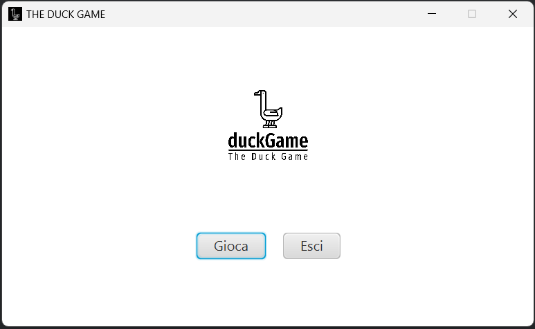
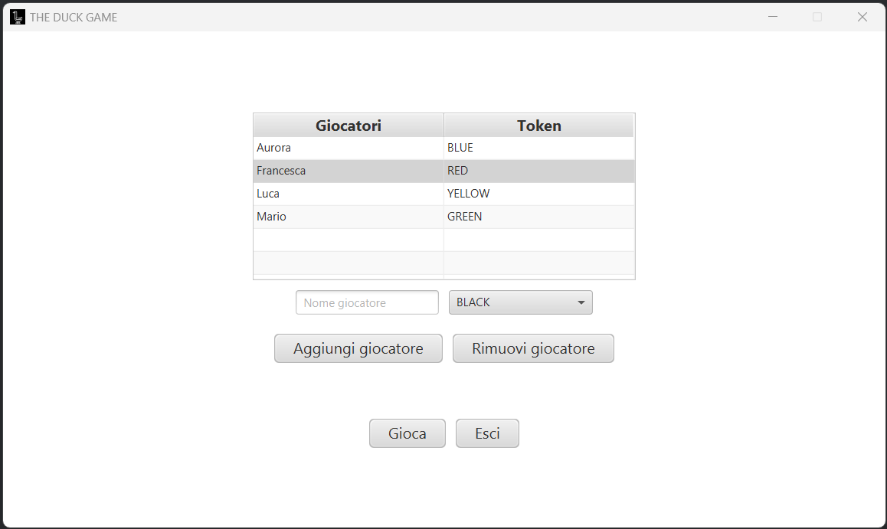

# 6. Guida utente

## StartMenuView

All'avvio dell'applicazione, la schermata che si presenta è relativamente semplice. Vengono visualizzati due pulsanti: cliccando su uno di essi, si aprirà il menù per l'aggiunta dei giocatori; invece cliccando sull'altro bottone l'applicazione verrà chiusa ([Fig. 1]). L'immagine sottostante è modellata dalla classe `StartMenuView` e controllata dal rispettivo controller `StartMenuController`.

  
  
 Fig. 1 - Schermata iniziale del gioco 

[Fig. 1]: ../img/StartGameView.png

## PlayersMenuView
Se si clicca sul pulsante "Gioca", verrà aperta una pagina di configurazione ed aggiunta giocatori modellata da `PlayersMenuView` e controllata da `playersMenuController`. Come si può notare nell'immagine ([Fig. 2]), ogni giocatore deve inserire il nome con cui identificarsi durante la partita e scegliere il colore della propria pedina dall'elenco a tendina, modellato attraveso una *ComboBox*.

  
  
 Fig. 2 - Schermata di configurazione aggiunta dei giocatori 

[Fig. 2]: ../img/HomeGameView.png

Inoltre, è possibile cancellare un giocatore selezionandolo all'interno della lista e cliccando sul pulsante "Rimuovi giocatore". Quando si è pronti ad iniziare la partita si selezioni il pulsante "Gioca", previo inserimento di almeno 2 giocatori.

Anche da questa schermata è possibile abbandonare il gioco, premendo il pulsante "Esci".

## GameBoardView
All'avvio della partita ([Fig. 3]), i giocatori si trovano sopra la casella di partenza. L'ordine di gioco viene deciso in modo casuale. Alla sinistra del tabellone è visibile la lista dei giocatori, ordinata in base ai turni di gioco, e nella parte alta viene evidenziato il giocatore attualmente di turno. In aggiunta, è stata creata una *Box Area* al cui interno viene stampato il messaggio relativo allo spostamento del giocatore corrente a seguito del lancio dei dadi. Dalla parte opposta, quindi alla destra del tabellone, sono visualizzati i dadi e sono presenti i pulsanti "Lancia dadi", "Fine turno" e "Abbandona la partita",  attraverso cui ogni utente deve interagire per poter giocare la partita. 

  
  
 Fig. 3 - Schermata rappresentativa del tabellone di gioco 

[Fig. 3]: ../img/GameBoardView.png

## Victory view

All'interno del sistema è stato implementato un meccanismo di *Alert*, per segnalare eventi cruciali della partita, come la vittoria di un giocaotre ([Fig. 4]), se il gioco entra in uno stato di stallo o quando un giocatore capita sulle caselle speciali del pozzo e della prigione.

  
  
 Fig. 4 - Alert per la vittoria della partita 

[Fig. 4]: ../img/VictoryView.png

