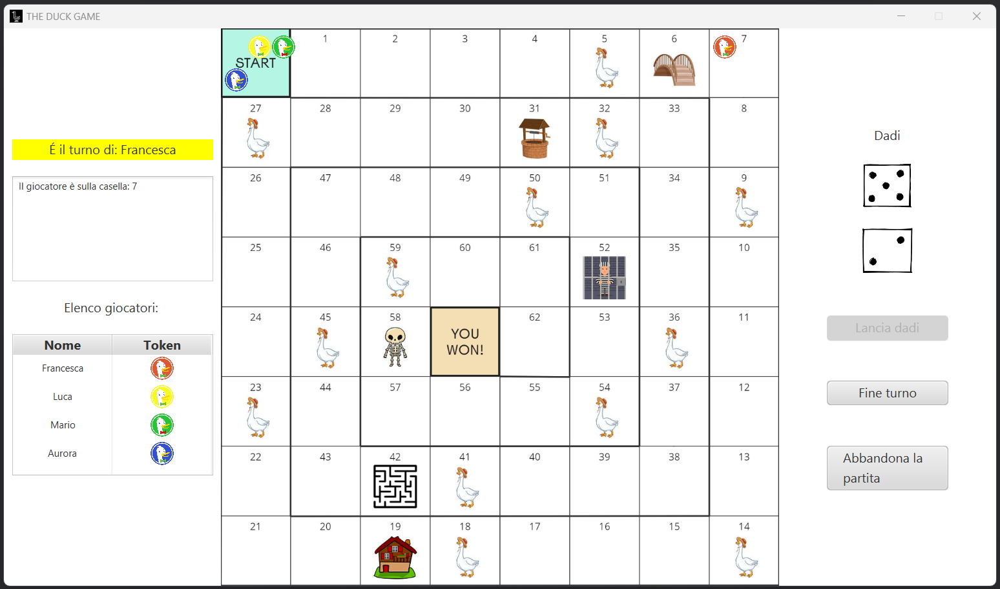

# 6. Guida utente

## Pagina di avvio

All'avvio dell'applicazione, la schermata che si presenta è relativamente semplice. 
Vengono visualizzati due pulsanti: cliccando su "Gioca", verrà mostrato il menù per la configurazione ed aggiunta dei giocatori; invece cliccando su "Esci" l'applicazione sarà chiusa ([Fig. 1]).

  
  
 Fig. 1 - Schermata iniziale del gioco 

[Fig. 1]: ../img/StartGameView.png

## Configurazione giocatori
Questa è la schermata per la configurazione ed aggiunta dei giocatori alla nuova partita. Come si può notare nell'immagine ([Fig. 2]), ogni giocatore deve inserire il nome con cui identificarsi durante la partita e scegliere il colore della propria pedina dall'elenco a tendina.

  
  
 Fig. 2 - Schermata di configurazione aggiunta dei giocatori 

[Fig. 2]: ../img/HomeGameView.png

Inoltre, è possibile cancellare un giocatore selezionandolo all'interno della lista e cliccando sul pulsante "Rimuovi giocatore". Quando si è pronti ad iniziare la partita si selezioni il pulsante "Gioca", previo inserimento di almeno 2 giocatori.

Anche da questa schermata è possibile abbandonare il gioco, premendo il pulsante "Esci".

## Schermata di gioco
All'avvio della partita ([Fig. 3]), i giocatori vengono collocati sopra la casella di partenza. L'ordine di gioco viene deciso in modo casuale. Alla sinistra del tabellone è visibile la lista dei giocatori, ordinata in base al turno di gioco, e nella parte alta è evidenziato il giocatore corrente. In aggiunta, è stata creata una *Box Area* al cui interno viene stampato il messaggio relativo allo spostamento del giocatore corrente a seguito del lancio dei dadi. Dalla parte opposta, quindi alla destra del tabellone, sono visualizzati i dadi e sono presenti i pulsanti "Lancia dadi", "Fine turno" e "Abbandona la partita", attraverso cui ogni utente deve interagire per poter giocare. Ogni pulsante viene disabilitato in caso non possa essere cliccato: ad esempio, se un giocatore ha già effettuato il lancio dei dadi nel suo turno, potrà solamente terminare il proprio turno o, eventualmente, abbandonare la partita. 

  
  
 Fig. 3 - Schermata rappresentativa del tabellone di gioco 

[Fig. 3]: ../img/GameBoardView.png

## Avvertimento vincitore

All'interno del sistema è stato implementato un meccanismo di *Alert*, per segnalare eventi cruciali della partita, come la vittoria di un giocatore ([Fig. 4]), se il gioco entra in uno stato di stallo o quando un giocatore capita sulle caselle speciali del "pozzo" o della "prigione".

  
  
 Fig. 4 - Alert per la vittoria della partita 

[Fig. 4]: ../img/VictoryView.png

