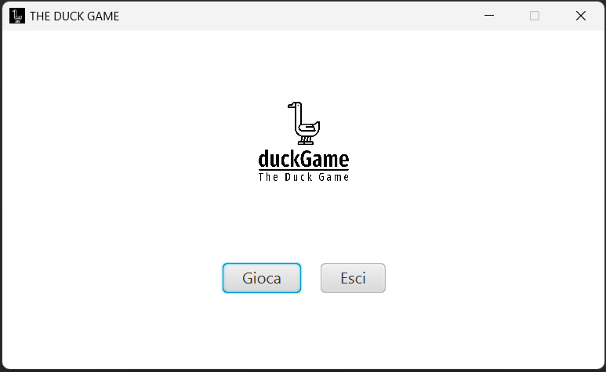
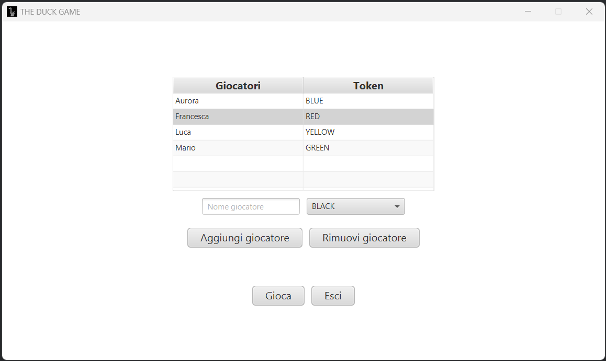
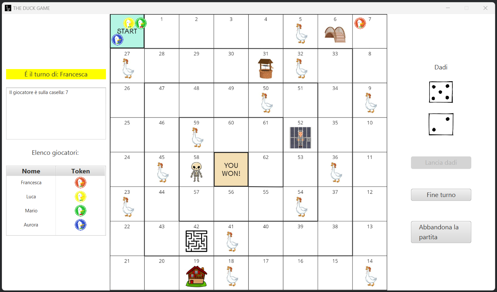
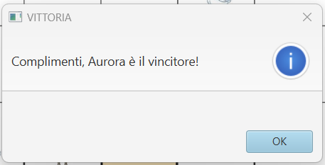

# 8. Guida utente

## StartMenuView

All'avvio dell'applicazione, il giocatore potrà segliere se avviare il gioco oppure chiudere l'applicativo ([Fig. 1]). L'immagine sottostante è modellata da `StartMenuView`
e controllata dal rispettivo controller `StartMenuController`.

  
  
 Fig. 1 - Schermata iniziale del gioco 

[Fig. 1]: img/StartGameView.png

## PlayersMenuView
Se si sceglie di giocare una partita, ci si troverà di fronte alla pagina di configurazione e aggiunta dei giocatori modellata da `PlayersMenuView` e controllata da `playersMenuController`. Come si può notare dall'immagine ([Fig. 2]) ogni giocatore deve inserire il nome con cui identificarsi durante la partita e scegliere il coloredella propria pedina dall'elenco modellato attraveso una *ComboBox*.

  
  
 Fig. 2 - Schermata di configurazione aggiunta dei giocatori 

[Fig. 2]: img/HomeGameView.png

Inoltre, è possibile cancellare un giocatore selezionandolo all'interno della lista e cliccando sul pulsante "Rimuovi giocatore". Quando si è pronti ad iniziare la partita si selezioni il pulsante "Gioca", previo inserimento di almeno 2 giocatori.

## GameBoardView
All'avvio della partita ([Fig. 3]) tutti i giocatori si trovano tutti sulla casella di partenza, in maniera casuale. Alla sinistra del tabellone è visibile la lista
ordinata dei giocatori e in evidenza il giocatore che è di turno. In aggiunta, è stata creata una box Area al cui interno viene stampato il messaggio relativo allo
spostamento del giocatore corrente a seguito del lancio dei dadi. Dalla parte opposta, quindi alla destra del tabellone, sono visualizzati i dadi e sono presenti i
pulsanti "Fine turno", "Abbandona la partita" e "Lancia dadi" attraverso cui ogni utente deve interagire per poter giocare la partita. 

  
  
 Fig. 3 - Schermata rappresentativa del tabellone di gioco 

[Fig. 3]: /img/GameBoardView.png

## Victory view

All'interno del sistema è stato implementato un meccanismo di alert, per segnalare eventi cruciali della partita come la vittoria di un giocaotre ([Fig. 4]), lo stato di stallo del gioco o quando un giocatore capita sulle caselle speciali del pozzo e della prigione.

  
  
 Fig. 4 - Alert per la vittoria della partita 

[Fig. 4]: img/VictoryView.png

